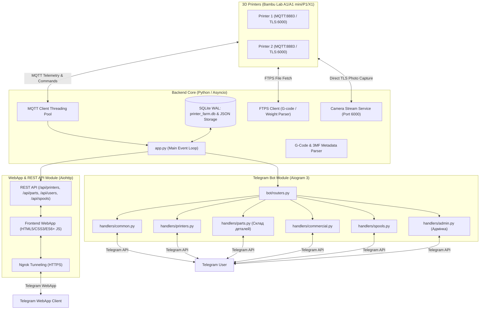

# 📘 Архітектура та Функціонал системи управління 3D-принтерами Bambu Lab

Даний документ містить детальний опис архітектури, технічної реалізації та функціональних можливостей двох основних компонентів системи: **Telegram-бота** та **веб-версії (WebApp / REST API)**.

---

## 🏗️ 1. Загальна Архітектура Системи

Система побудована за модульним асинхронним принципом на мові Python (3.13) та розрахована на безперервну роботу на сервері/Raspberry Pi 24/7.

---

## 🤖 2. Telegram-бот: Архітектура та Функції

Telegram-бот реалізований на фреймворку **Aiogram 3.x** з використанням модульних роутерів (`Router`) та скінченного автомата станів (**FSM**).

### 2.1. Технічні Особливості Бот-модуля
* **Фреймворк**: Aiogram 3 (асинхронне оброблення подій).
* **Багатомовність (i18n)**: Повна підтримка української (`uk`) та англійської (`en`) мов із можливістю перемикання на льоту.
* **Безпека та Flash Wear Protection**: База даних на SQLite з режимом `WAL` (`printer_farm.db`) та асинхронним збереженням JSON, що захищає MicroSD-карту Raspberry Pi від передчасного зносу.
* **Обробка зображень та документів**: Автоматична підтримка стиснутих фотографій `message.photo` та несжиманих зображень у форматі PNG/JPG `message.document` з автозавантаженням у локальну директорію `/uploads/`.
* **Автоматичне зчитування 3MF**: Зчитування метаданих про сумісну модель принтера (`Bambu Lab A1`, `P1S`, `A1 mini`) безпосередньо з `.3mf` архівів.

### 2.2. Функціональні Можливості Telegram-бота

#### 🖨️ А. Моніторинг та Управління Принтерами (`handlers/printers.py`)
1. **Інтерактивна ферма принтерів**:
   - Перегляд списку всіх підключених принтерів та їх поточного стану (`RUNNING`, `IDLE`, `PAUSE`, `FINISH`, `PREPARING`, `OFFLINE`).
2. **Детальна картка принтера**:
   - **Температури**: Поточна та цільова температура сопла (`Nozzle`) і столу (`Bed`).
   - **Прогрес друку**: Відсоток виконання, поточний та загальний шар (`Layer X/Y`), час до завершення.
   - **Назва моделі**: Поточне завдання/файл.
   - **Сумісність**: Відображення моделі принтера в окремому абзаці картки деталі.
3. **Реальний час камери (`📷 Камера`)**:
   - Пряме зчитування кадру JPEG з порту `6000` (TLS) принтера Bambu Lab без блокування основних потоків.
4. **Управління друком**:
   - Кнопки `Пауза`, `Відновити`, `Зупинити друк`.
   - Кліматичний контроль: Управління підсвіткою камери та швидкістю друку (`Standard`, `Silent`, `Sport`, `Ludicrous`).
5. **Редагування даних принтера**:
   - Інтерактивне меню FSM для зміни Назви, IP-адреси, Серійного номера (SN) та Access Code.

#### 🧩 Б. Склад Готових Деталей (`handlers/parts.py`)
1. **Управління інвентарем деталей**:
   - Облік готових 3D-друкованих деталей: Назва, Кількість (шт), Фото деталі, прив'язаний `.3mf` файл друку та визначена модель принтера.
2. **Строга валідація вводу**:
   - **Назва**: обов'язкове текстове поле (непорожнє).
   - **Кількість**: перевірка на ціле додатне число (захист від `abc` чи від'ємних значень).
   - **Фото**: автоматичний контроль форматів зображення (`.jpg`, `.png`, `.webp`, `.gif`).
   - **Файл друку**: валідація обов'язкового розширення `.3mf`.
3. **Пошук деталей за назвою (`🔍 Пошук`)**:
   - Інтерактивний FSM-пошук деталі за назвою або моделлю принтера з виводом знайдених результатів у вигляді інлайн-клавіатури.
4. **Запуск друку деталі в один клік**:
   - Відправка деталі на обраний сумісний принтер ферми з перевіркою відповідності моделі та пластику.

#### 👑 В. Управління Доступом та Адмінка (`handlers/admin.py`)
1. **Розмежування прав (ADMIN / USER)**:
   - Меню `👑 Адмінка` доступне **виключно адміністраторам**. Для звичайних користувачів воно приховано.
2. **Управління користувачами**:
   - Підтвердження доступу нових користувачів (`✅ Додати в команду`).
   - Надання та відкликання прав адміністратора (`👑 Призначити адміном` / `🔻 Забрати адміна`).
   - Повне видалення користувачів із бази.

#### 💰 Г. Комерція та Склад Пластику (`handlers/commercial.py`, `handlers/spools.py`)
1. **Калькулятор себевартості**:
   - Автоматичний розрахунок собівартості на основі ваги пластику, часу друку, амортизації та тарифу електроенергії.
2. **Склад котушок**:
   - Облік залишків филаменту за кольорами, типом (PLA, PETG, ABS) та виробниками з автосписанням при завершенні друку.

---

## 🌐 3. Веб-версія (WebApp & REST API): Архітектура та Функції

Веб-версія інтегрована безпосередньо в основний сервер на базі **aiohttp.web** і доступна у звичайному браузері та через **Telegram WebApp SDK**.

### 3.1. Технічні Особливості Веб-модуля
* **Бекенд**: Python `aiohttp.web` (асинхронне виконання в єдиній подійній петлі).
* **Фронтенд**: HTML5, CSS3 (Glassmorphism, Responsive Grid/Flexbox), Vanilla JavaScript (ES6+).
* **Мобільна & Десктопна Оптимізація**:
  - Повна адаптивність під екрани смартфонів (< 600px) з підтримкою темної теми та Haptic Feedback.
  - На ПК додано видимі градієнтні горизонтальні повзунки (`.table-responsive::-webkit-scrollbar`) для комфортного перетягування шикроких таблиць мишкою.
* **Безпека API**: Строга перевірка адміністраторських прав. Ендпоінти адміністрування повертають `403 Forbidden` для звичайних користувачів.

### 3.2. REST API Ендпоінти (`services/http/`)

| Метод | Ендпоінт | Права | Опис |
| :--- | :--- | :---: | :--- |
| `GET` | `/api/printers` | User | Список усіх принтерів, їх станів, температур та AMS |
| `POST` | `/api/printers` | User | Додавання нового принтера |
| `PUT` | `/api/printers/{id}` | User | Оновлення параметрів принтера |
| `DELETE` | `/api/printers/{id}` | User | Видалення принтера |
| `GET` | `/api/parts` | User | Отримання склада готових деталей |
| `POST` | `/api/parts` | User | Додавання або редагування деталі |
| `DELETE` | `/api/parts/{id}` | User | Видалення деталі зі складу |
| `POST` | `/api/parts/{id}/print/{p_id}` | User | Запуск друку деталі на обраному принтері |
| `POST` | `/api/files/upload_image` | User | Завантаження фотографії деталі на сервер |
| `POST` | `/api/files/upload` | User | Завантаження та аналіз `.3mf` файлу друку |
| `GET` | `/api/users` | **Admin** | Отримання списку користувачів |
| `POST` | `/api/users/access` | **Admin** | Зміна статусу доступу або ролі (ADMIN/USER) |
| `POST` | `/api/users/delete` | **Admin** | Видалення користувача з бази |
| `GET` | `/api/spools` | User | Список котушок пластику |
| `GET` | `/api/history` | User | Журнал виконаних робіт |
| `GET` | `/webapp` | User | Головна сторінка WebApp |

### 3.3. Функціональні Можливості WebApp UI

1. **Дашборд ферми (Fleet Overview)**:
   - Картки станцій з анімованими індикаторами температур, статусами та кнопками швидкого управління.
2. **Склад деталей (Parts Warehouse Tab)**:
   - Відображення карток деталей із прев'ю фотографій, лічильниками кількості `+ / -`, прив'язаними `.3mf` файлами та моделлю принтера.
   - **Швидкий пошук**: інтерактивне поле пошуку деталі за назвою або моделлю в реальному часі.
   - **Модальні вікна**: створення та редагування деталей із валідацією полів та завантаженням фото/3MF файлів.
3. **Управління доступом (Адмінка)**:
   - Блок `Управління доступом користувачів (Адмінка)` **приховано за замовчуванням** (`display: none;`).
   - Динамічно відображається **тільки для користувачів з роллю ADMIN**.
4. **Адаптивний дизайн та Драгабельні Повзунки**:
   - Адаптовані таблиці з підтримкою прокручування мишкою на ПК та тач-жестів на смартфонах.

---

### 3.4. Останні Архітектурні та Протокольні Вдосконалення

1. **Миттєва Перевірка Запису на SD-картку via FTPS `SIZE` (`services/ftps_client.py`)**:
   - Замість фіксованої паузи `sleep(2.0)` впроваджено активну функцію `verify_bambu_file_size()`. Вона звертається до SD-карти принтера через FTPS-команду `SIZE` та порівнює фактичний розмір збереженого файлу з точною кількістю байт `len(file_bytes)` перед відправкою команди запуску.

2. **Повна Відповідність Протоколу Bambu Lab MQTT (`models/printer.py`)**:
   - **Префікс `Metadata/`**: Усі шляхи пластин у параметрі `param` примусово гарантують наявність префіксу (наприклад, `Metadata/plate_1.gcode`).
   - **Динамічні Ідентифікатори**: `sequence_id`, `project_id`, `profile_id`, `task_id` та `subtask_id` генеруються у вигляді унікальних числових рядків на базі timestamps.
   - **Суворі Типи Даних**: Параметри `use_ams` та калібрувальні прапорці передаються як булеві `true`/`false`, а `ams_mapping` — як масив цілих чисел (наприклад `[0]` для AMS або `[]` для принтерів без AMS).
   - **Оптимізація Time-Lapse**: Прапорець `"timelapse": False` вимикає зайве відведення голови на кожен шар.

3. **Захист Списання Ваги та Збереження Кириличних Назв**:
   - **Підтримка Юнікоду**: Очищення назв деталей переведено на безпечний режим `re.sub(r'[\\/:*?"<>|\x00-\x1f]', "_", ...)`, що повністю зберігає українські літери (`куб тпу`, `Шестірня`) в історії друку.
   - **Захист телеметрії**: Прапорець `_job_started_from_app` запобігає скиданню порахованої ваги деталі при надходженні проміжних назв підзавдань з MQTT-телеметрії принтера.

4. **Розшифрування 16-значних Hex Помилок HMS (`services/hms_resolver.py`)**:
   - Підтримка декодування 16-значних hex кодів Bambu Lab HMS (наприклад, `HMS0002000212FF2000` -> Категорія `0200` Вентилятори та Вугільний фільтр) з виводом релевантного текстового опису українською мовою.

---

## 📊 5. Порівняльна Таблиця Інтерфейсів

| Функція | Telegram-бот | WebApp (Веб-версія) |
| :--- | :---: | :---: |
| Перегляд станів та температур | 🟢 Текст + Кнопки | 🟢 Графічний Дашборд |
| Фото з камери | 🟢 Фото-повідомлення | 🟢 Live Stream / Canvas |
| Пуш-сповіщення про завершення | 🟢 Миттєві Telegram пуші | 🔴 Відсутні |
| Склад деталей та Пошук | 🟢 Текстове меню + 🔍 Пошук | 🟢 Картки + Live Search |
| Валідація форматів (3MF, Фото, Кількість) | 🟢 Попередження в чаті | 🟢 Інтерактивні підказки |
| Адмінка користувачів | 🟢 Для ADMIN | 🟢 Для ADMIN (Приховано для USER) |
| Калькулятор вартості | 🟢 Покроковий FSM | 🟢 Інтерактивна форма |

---
*Документ актуалізовано для проекту tgBOT3dDprinters. Дата оновлення: Серпень 2026.*
