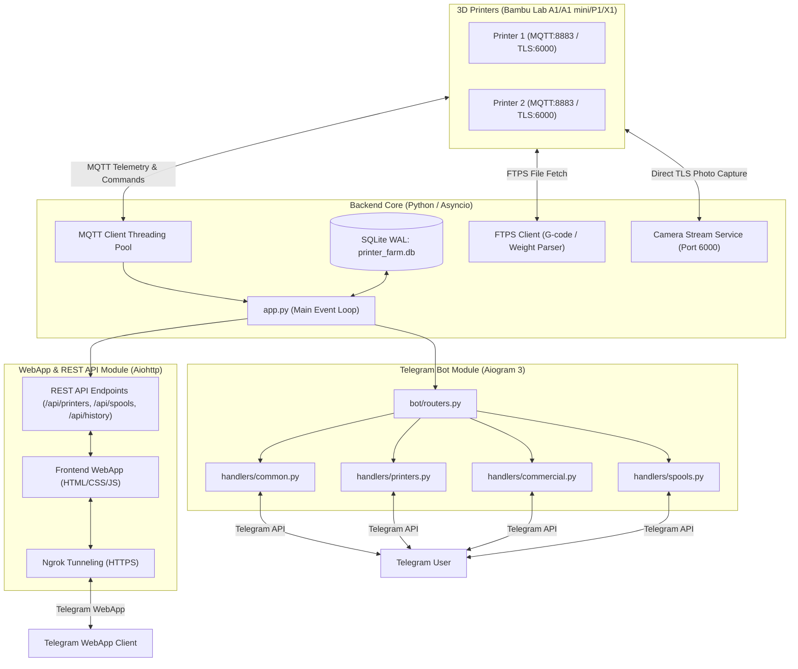

# 📘 Архітектура та Функціонал системи управління 3D-принтерами Bambu Lab

Даний документ містить детальний опис архітектури, технічної реалізації та функціональних можливостей двох основних компонентів системи: **Telegram-бота** та **веб-версії (WebApp / REST API)**.

---

## 🏗️ 1. Загальна Архітектура Системи

Система побудована за модульним асинхронним принципом на мові Python (3.13) та розрахована на безперервну роботу на сервері/Raspberry Pi 24/7.

---

## 🤖 2. Telegram-бот: Архітектура та Функції

Telegram-бот реалізований на фреймворку **Aiogram 3.x** з використанням модульних роутерів (`Router`) та скінченного автомата станів (**FSM**).

### 2.1. Технічні Особливості Бот-модуля
* **Фреймворк**: Aiogram 3 (асинхронне оброблення подій).
* **Багатомовність (i18n)**: Повна підтримка української (`ua`) та англійської (`en`) мов із можливістю перемикання на льоту.
* **Безпека та Flash Wear Protection**: База даних на SQLite з режимом `WAL` (`printer_farm.db`), що захищає MicroSD-карту Raspberry Pi від передчасного зносу.
* **Автоматична очистка підключень**: Призводить до негайного відключення старого сокета `destroy()` при оновленні IP/SN/Access Code та підключенні нового.

### 2.2. Функціональні Можливості Telegram-бота

#### 🖨️ А. Моніторинг та Управління Принтерами (`handlers/printers.py`)
1. **Інтерактивна ферма принтерів**:
   - Перегляд списку всіх підключених принтерів та їх поточного стану (`RUNNING`, `IDLE`, `PAUSE`, `FINISH`, `PREPARING`, `OFFLINE`).
2. **Детальна картка принтера**:
   - **Температури**: Поточна та цільова температура сопла (`Nozzle`) і столу (`Bed`).
   - **Прогрес друку**: Відсоток виконання, поточний та загальний шар (`Layer X/Y`), час до завершення.
   - **Назва моделі**: Поточне завдання/файл.
   - **Калібрування**: Статус калібрування з захистом від помилкового списання пластику.
   - **Залишок філаменту**: Відображення активної котушки та AMS лотка.
3. **Реальний час камери (`📷 Камера`)**:
   - Пряме зчитування кадру JPEG з порту `6000` (TLS) принтера Bambu Lab без попередніх TCP-проб, що запобігає заблокованим портам.
4. **Управління друком**:
   - Кнопки `Пауза`, `Відновити`, `Зупинити друк`.
   - Кліматичний контроль: Управління підсвіткою камери та швидкістю друку (`Standard`, `Silent`, `Sport`, `Ludicrous`).
5. **Запуск калібрування (`⚙️ Калібрування`)**:
   - Відправка команд автоматичного вирівнювання столу та калібрування з відстеженням статусу.
6. **Редагування даних принтера (`✏️ Редагувати принтер`)**:
   - Інтерактивне меню FSM для зміни:
     - 📝 **Назви принтера**
     - 🌐 **IP-адреси**
     - 🔢 **Серійного номера (SN)**
     - 🔑 **Access Code (Коду доступу)**
   - З автоматичною очисткою пробілів та миттєвим перезапуском MQTT-з'єднання.

#### 💰 Б. Комерційний Розрахунок та Звіти (`handlers/commercial.py`)
1. **Калькулятор вартості друку**:
   - Автоматичний розрахунок собівартості та рекомендованої ціни на основі:
     - Ваги використаного пластику (в грамах).
     - Часу друку (в годинах).
     - Амортизації обладнання та вартості електроенергії.
2. **Експорт звітів**:
   - Генерація звітів за обраний період (день, тиждень, місяць) у формати PDF/Excel (`services/report_generator.py`).

#### 🧵 В. Інвентар Котушок Пластику (`handlers/spools.py`)
1. **Управління котушками**:
   - Додавання, редагування та списування котушок филаменту (PLA, PETG, ABS, TPU тощо).
   - Синхронізація з Bambu Lab AMS через RFID мітки.
2. **Автоматичне списування ваги**:
   - При завершенні друку бот автоматично вираховує точну вагу моделі з активної котушки в AMS або зовнішньому лотку.

#### ⚙️ Г. Загальні Налаштування (`handlers/common.py`)
- Перемикання мови інтерфейсу (Українська / English).
- Налаштування сповіщень (повідомлення про завершення друку, помилки HMS, зміну статусу).
- Кнопка швидкого відкриття **Telegram WebApp**.

---

## 🌐 3. Веб-версія (WebApp & REST API): Архітектура та Функції

Веб-версія інтегрована безпосередньо в основний сервер на базі **aiohttp.web** і доступна як у звичайному браузері, так і всередині Telegram через **Telegram WebApp SDK**.

### 3.1. Технічні Особливості Веб-модуля
* **Бекенд**: Python `aiohttp.web` (працює в єдиному асинхронному циклі з ботом).
* **Фронтенд**: HTML5, CSS3 (Modern Flexbox/Grid, Dark Mode UI), Vanilla JavaScript (ES6+).
* **Публічний доступ**: Автоматична підтримка HTTPS тунелювання через **Ngrok** (`pyngrok`) для безпечного відкриття WebApp у Telegram.
* **Real-time оновлення**: REST API з періодичним опитуванням (polling) та підготовкою під WebSocket для відображення живих температур та прогресу.

### 3.2. REST API Ендпоінти (`app.py`)

| Метод | Ендпоінт | Опис |
| :--- | :--- | :--- |
| `GET` | `/api/printers` | Отримання списку всіх принтерів, їх станів, температур, шарів та AMS |
| `POST` | `/api/printers` | Додавання нового принтера |
| `PUT` | `/api/printers/{id}` | Оновлення параметрів принтера (IP, SN, Access Code) |
| `DELETE` | `/api/printers/{id}` | Видалення принтера |
| `POST` | `/api/printers/{id}/command` | Відправка команд (Pause, Resume, Stop, Light, Speed) |
| `GET` | `/api/camera/{id}` | Отримання свіжого JPEG кадру з камери принтера |
| `GET` | `/api/spools` | Список усіх котушок филаменту |
| `POST` | `/api/spools` | Створення/оновлення котушки |
| `GET` | `/api/history` | Історія виконаних завдань друку |
| `GET` | `/webapp` | Головна сторінка Telegram WebApp інтерфейсу |

### 3.3. Функціональні Можливості Веб-версії (WebApp UI)

1. **Дашборд всієї ферми (Fleet Overview)**:
   - Візуальні картки кожного принтера з колірною індикацією стану (`Зелений` — друк, `Синій` — готовність, `Червоний` — помилка/офлайн).
   - Індикатори температур сопла та столу з графічною анімацією.
   - Круговий або лінійний прогрес-бар поточного друку.
2. **Інтерактивна медиа-галерея та Live-камера**:
   - Відображення трансляції/фотографій з камери у високій роздільній здатності прямо в браузері.
3. **Управління AMS та лотками**:
   - Наочне відображення 4 лотків Bambu AMS (або декількох блоків AMS): колір пластику, тип (PLA/PETG), рівень залишку.
4. **Управління друком в один клік**:
   - Швидкі кнопки управління (Пауза / Відновлення / Зупинка / Світло).
5. **Адаптивний мобільний дизайн**:
   - Оптимізовано для Telegram Mini Apps (підтримка мобільних жестів, темної теми Telegram, вибрацій haptic feedback).

---

## 🔒 4. Безпека та Надійність Системи

1. **TLS / SSL Шифрування**:
   - Усі підключення до принтерів Bambu Lab (MQTT на порту `8883` та Відео на порту `6000`) використовують захищене TLS-шифрування з автентифікацією за Access Code.
2. **Обробка HMS Помилок (`services/hms_resolver.py`)**:
   - Автоматичне розшифрування банарних кодів помилок Bambu Lab HMS та надання посилань на офіційну документацію Bambu Wiki.
3. **Ізоляція ресурсів та SD Card Life Protection**:
   - Використання SQLite WAL режимів знижує кількість операцій запису на диск у 10-15 разів.
   - FTPS підключення виконуються в окремих асинхронних потоках (`asyncio.to_thread`) і не блокують головний потік бота.

---

## 📊 5. Порівняльна Таблиця Інтерфейсів

| Функція | Telegram-бот | WebApp (Веб-версія) |
| :--- | :---: | :---: |
| Перегляд станів та температур | 🟢 Текст + Кнопки | 🟢 Графічний Дашборд |
| Фото з камери | 🟢 Фото-повідомлення | 🟢 Live Stream / Canvas |
| Пуш-сповіщення про завершення | 🟢 Миттєві Telegram пуші | 🔴 Відсутні |
| Редагування конфігурації принтера | 🟢 FSM Діалог | 🟢 Веб-форма / Модальне вікно |
| Калькулятор вартості | 🟢 Покроковий FSM | 🟢 Інтерактивна форма |
| Управління котушками AMS | 🟢 Меню кнопок | 🟢 Палітра кольорів та лотків |

---
*Документ створено автоматично для проекту tgBOT3dDprinters. Дата оновлення: Серпень 2026.*
