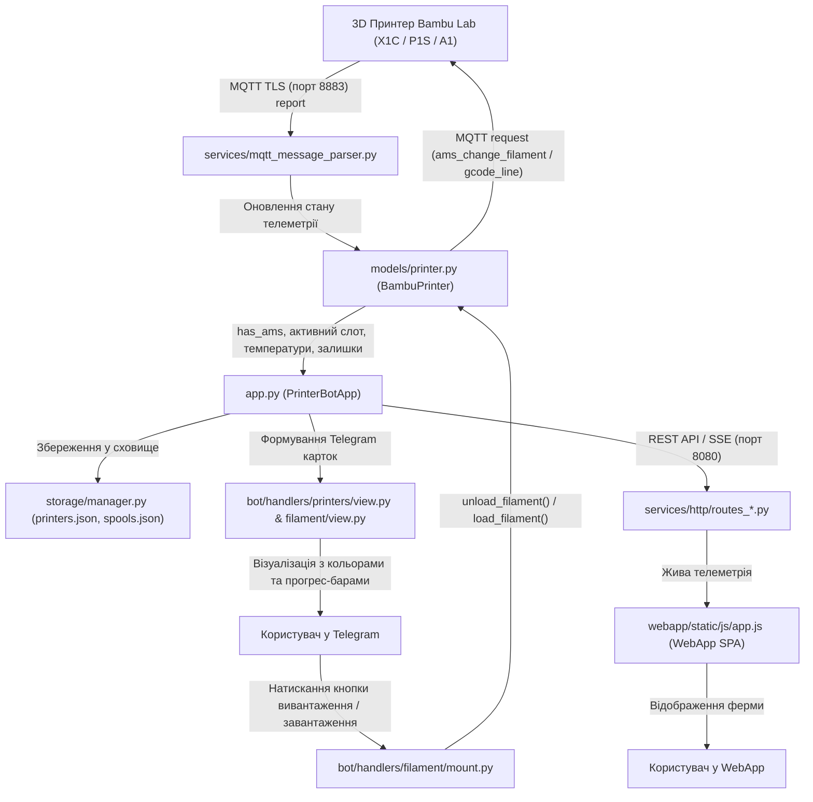

# 🗺️ НАВІГАТОР ПО ПРОЄКТУ: Структура файлів та архітектура кодової бази
> **Призначення файлу**: Цей документ містить вичерпний опис структури кожної папки та файлу в репозиторії.  
> **Для ШІ-асистента та розробників**: Використовуйте цей файл як єдину точку входу (Single Source of Truth), щоб миттєво знаходити потрібний модуль, клас чи функцію, не переглядаючи весь репозиторій.

---

## ⚡ Швидкий пошук: «Де що лежить?»

| Завдання / Функціонал | Головний файл | Допоміжні файли |
| :--- | :--- | :--- |
| **Картка статусу принтера (`/status`, кольори, слоти AMS)** | `bot/handlers/printers/view.py` | `models/printer.py`, `utils/filament_utils.py` |
| **Клавіатури Telegram (Reply / Inline, сітка 2x2 AMS)** | `bot/keyboards.py` | `bot/states.py`, `utils/i18n.py` |
| **Керування AMS: прогрес-бари, активне сопло, список слотів** | `bot/handlers/filament/view.py` | `models/printer.py`, `services/mqtt_message_parser.py` |
| **Команди Load / Unload (завантаження / вивантаження нитки)** | `models/printer.py` | `bot/handlers/filament/mount.py` |
| **Монтування та зняття котушок зі складу на принтер** | `bot/handlers/filament/mount.py` | `storage/manager.py` |
| **Розпізнавання кольорів Bambu RFID (hex ➔ емодзі/назва)** | `utils/filament_utils.py` | `tests/test_filament_color_recognition.py` |
| **Парсинг телеметрії Bambu Lab MQTT** | `services/mqtt_message_parser.py` | `models/printer.py` |
| **Розшифровка HMS помилок Bambu Wiki** | `services/hms_resolver.py` | `bot/handlers/printers/view.py` |
| **Парсинг 3MF / G-code (шари, вага, час друку, фото столу)** | `services/gcode_parser.py` | `services/ftps_client.py` |
| **WebApp Фронтенд (інтерфейс, модальні вікна, камери)** | `webapp/index.html` | `webapp/static/js/app.js` |
| **REST API бекенд для WebApp** | `services/http/routes_*.py` | `services/http_server.py`, `app.py` |
| **База даних та сховище (JSON / SQLite)** | `storage/manager.py` | Папка `printers_storage/` |
| **Деплой на Raspberry Pi без коміту в Git** | `deploy_to_pi.py` | `scripts/printer_bot.service` |

---

## 📂 Детальний опис файлової структури

### 1. Кореневі файли запуску та конфігурації
* **`printer.py`**: Точка входу за замовчуванням для systemd-сервісу на Raspberry Pi (`tgbot.service`). Імпортує та викликає функцію `main()` з `main.py`.
* **`main.py`**: Головний асинхронний скрипт ініціалізації: створює екземпляр `PrinterBotApp()` і запускає `asyncio.run(app.run())`.
* **`app.py`**: Ядро всієї системи (`class PrinterBotApp`).
  * Ініціалізує екземпляри Aiogram Bot та Dispatcher.
  * Завантажує конфігурацію принтерів зі `storage`.
  * Запускає фоновий MQTT-клієнт для кожного принтера (`BambuPrinter.connect()`).
  * Піднімає Aiohttp HTTP-сервер для WebApp REST API та WebSockets/SSE.
  * Керує фоновими тасками перевірки доступності, сповіщень та синхронізації.
* **`config.py`**: Конфігураційний модуль проєкту.
  * Читає змінні оточення (`.env`): токен бота, IP-адреси, шляхи, паролі, налаштування камери, веб-домен Ngrok/Cloudflare.
  * Визначає ролі адміністраторів та шляхи до файлів даних.
* **`deploy_to_pi.py`**: Скрипт автоматичного деплою на Raspberry Pi через Paramiko (SFTP). Завантажує оновлені файли за вказаним списком та перезапускає `sudo systemctl restart tgbot` без комітів чи пушів у Git.
* **`orca_hook.py`**: Скрипт інтеграції з OrcaSlicer для перехоплення подій відправки на друк.
* **`pyproject.toml`** / **`requirements.txt`**: Залежності проєкту (Aiogram 3, paho-mqtt, aiohttp, paramiko, pytest тощо).

---

### 2. `bot/` — Логіка Telegram-бота (Aiogram 3)
* **`bot/keyboards.py`**: Усі меню та кнопки бота:
  * `get_main_keyboard(is_admin, lang)`: Головне меню з кнопками «Принтери», «Стан ферми», «Склад», «Комерція» тощо.
  * `get_ams_slots_keyboard(printer, lang)`: Динамічна сітка 2x2 для вибору слотів AMS (`A1`, `A2`, `A3`, `A4`, `VT`, `Назад`) з кольоровими емодзі, типами пластику, залишками у `%` та позначкою активного сопла `⚡`.
  * `get_printer_menu_keyboard(...)`: Меню конкретного принтера (Статус, Камера, Керування, Філамент, Калібрувати, ТО).
  * `get_filament_menu_keyboard(...)`: Меню складу котушок.
  * `get_notify_keyboard(...)`: Меню налаштувань персональних сповіщень та вибору мови (`🇺🇦 / 🇬🇧`).
* **`bot/states.py`**: Стани FSM (Finite State Machine):
  * Додавання/редагування принтера.
  * Додавання, монтаж, списання та зміна ваги котушок.
  * Калькулятор вартості комерційного друку.
* **`bot/handlers/`**: Модульні роутери повідомлень:
  * **`start.py`**: Обробка `/start`, `/help`, верифікація доступу користувача.
  * **`common.py`**: Обробка кнопки «⬅️ Назад», повернення в попередні меню.
  * **`callbacks.py`**: Інлайн-кнопки (швидке списання грамів `2g/5g/10g/25g/50g`, пауза, підсвітка тощо).
  * **`admin.py`**: Панель адміністратора: затвердження нових користувачів, розсилки.
  * **`dashboard.py`**: Обробка кнопки «📊 Стан ферми» — зведений моніторинг усіх принтерів одночасно.
  * **`control.py`**: Керування друком: вибір швидкості (`Silent`, `Standard`, `Sport`, `Ludicrous`), вмикання/вимикання світла, пауза, відновлення, аварійна зупинка, запуск калібрування.
  * **`files.py`**: Надсилання файлів на друк через Telegram, вибір пластин, перегляд файлів на SD-картці принтера.
  * **`notifications.py`**: Налаштування персональних тригерів сповіщень для кожного користувача.
  * **`commercial.py`**: Комерційний калькулятор вартості друку з урахуванням собівартості, часу, електроенергії та маржі.

#### 2.1. `bot/handlers/printers/` — Підменю принтерів:
* **`view.py`**:
  * `build_printer_status_card(target_printer, is_en)`: Головна картка `/status`. Для AMS принтерів формує секцію `🌈 Слоти AMS:` (A1..A4, VT, індикатор вологості 1..5 та температуру AMS у стилі OrcaSlicer). Для звичайних принтерів — акуратний рядок `🧵 Філамент (VT):`.
  * Відображення знімків з камер принтерів.
* **`add.py`**: Покроковий майстер додавання нового принтера в систему (IP, Access Code, Серійний номер).
* **`edit.py`**: Редагування налаштувань принтера, зміна назви, скидання лічильників технічного обслуговування (ТО).
* **`delete.py`**: Видалення принтера з системи.
* **`ams.py`**: Допоміжні роутери взаємодії з модулями AMS.

#### 2.2. `bot/handlers/filament/` — Підменю філаменту та складу:
* **`view.py`**:
  * `handle_materials_menu`: Перегляд складу матеріалів, заправлених слотів і вільних котушок.
  * `handle_ams_slots`: Команда `🌈 Слоти AMS` — детальний екран AMS у стилі OrcaSlicer з текстовими прогрес-барами (`████████░░ 80%`), фіксацією активного сопла (`🔥 Подача в сопло: 🟢 A1 ⚡`) та датчиками мікроклімату.
  * `handle_rfid_sync`: Зчитування та автореєстрація котушок через Bambu RFID tag.
* **`mount.py`**:
  * Встановлення котушки зі складу на принтер (у слоти 0..3 або 254/VT).
  * Зняття котушки назад на склад із можливістю запуску апаратного вивантаження (`Unload`).
  * `parse_slot_key_from_text(text)`: Універсальний парсер назв слотів.
* **`add.py`**: Додавання нової котушки (тип пластику, назва, колір, вага, ціна за кг, партія).
* **`edit.py`**: Редагування залишку грамів або ціни котушки.
* **`delete.py`**: Списання або видалення котушки.
* **`movements.py`**: Журнал руху матеріалів (Audit Log), експорт історії та звітів.

#### 2.3. `bot/handlers/parts/` — Склад готових надрукованих деталей:
* **`view.py`**: Перегляд каталогу надрукованих деталей.
* **`add.py`** / **`edit.py`** / **`delete.py`**: Додавання, редагування залишків та видалення позицій деталей.
* **`print_job.py`**: Запуск друку деталі напряму зі складу готової продукції.

---

### 3. `models/` — Доменні моделі та об'єкти
* **`models/printer.py`**: Найбільший і найважливіший клас `BambuPrinter`:
  * `has_ams`: **100% повністю автоматичне визначення AMS** на основі живих даних MQTT (`ams_exist_bits`, `ams_units`, `ams_trays_info`, `active_ams_tray`).
  * `get_active_slot_key()`: Визначає, який саме слот зараз подає пластик у сопло.
  * `unload_filament()`: Апаратна команда вивантаження (надсилає `ams_change_filament target: 255`, а для зовнішнього слота VT прогріває сопло M109 і робить безпечний відкат G1 E-80).
  * `load_filament()`: Апаратна команда завантаження у сопло.
  * `_get_filament_temp()`: Автоматичний підбір температури сопла залежно від матеріалу (PLA: 220°C, PETG: 235°C, ABS: 250°C тощо).
  * Зберігання живих параметрів: температури, залишок часу, відсоток, шар, HMS-помилки, вологість AMS, фото.
* **`models/user.py`**: Модель користувача Telegram (ID, ім'я, мова `language`, роль `admin`/`operator`/`pending`, контекстні дані).
* **`models/commercial.py`**: Моделі комерційних розрахунків та пресетів вартості друку.
* **`models/enums.py`**: Переліки системи (`AMSSlot.A1 = "0"`, `AMSSlot.EXTERNAL = "254"`, статуси друку).

---

### 4. `services/` — Сервіси, мережеві протоколи та парсери
* **`services/mqtt_message_parser.py`**: Парсер вхідних JSON-пакетів топіку `device/<SERIAL>/report`:
  * Витягує `ams_units`, інформацію про треї в `ams_trays_info`, залишок `remain`, кольори `tray_color`, RFID теги `tag_uid`.
  * Парсить вологість `humidity` (1..5) та температуру всередині модуля AMS.
* **`services/hms_resolver.py`**: База знань кодів HMS (Health Management System) Bambu Lab. Перетворює цифрові помилки на зрозумілі інструкції з посиланнями на офіційну документацію Wiki.
* **`services/gcode_parser.py`**: Розбір файлів `.gcode` та `.3mf`. Читає мініатюри столів, оцінку часу, розподіл грамів за кольорами/слотами.
* **`services/ftps_client.py`**: FTPS-клієнт для підключення до принтера (порт 990) для викачування таймлапсів, прев'ю-зображень або завантаження файлів на SD-карту.
* **`services/camera_stream.py`**: Захоплення живого відеопотоку та отримання кадрів (RTSP/JPEG snapshot).
* **`services/gif_generator.py`**: Генератор анімованих GIF для візуалізації процесу друку в Telegram.
* **`services/report_generator.py`**: Генератор аналітичних звітів по використанню філаменту та роботі ферми.
* **`services/http_server.py`**: Налаштування та запуск веб-сервера Aiohttp.

#### 4.1. `services/http/` — REST API ендпоінти WebApp:
* **`routes_printers.py`**: `GET /api/printers`, додавання, редагування, отримання телеметрії та списку слотів.
* **`routes_control.py`**: `POST /api/printers/{id}/control` (старт, пауза, швидкість, світло, load/unload, калібрування).
* **`routes_spools.py`**: CRUD операції зі складом котушок, переміщення, зміна залишків.
* **`routes_parts.py`**: CRUD операції зі складом деталей.
* **`routes_files.py`**: Завантаження `.3mf` файлів через веб-інтерфейс.
* **`routes_settings.py`**: Збереження параметрів системи та сповіщень.
* **`routes_sse.py`**: Потокова трансляція оновлень (Server-Sent Events) у реальному часі для фронтенду WebApp.
* **`auth.py`** / **`middleware.py`** / **`routes_auth.py`**: Авторизація сесій WebApp та валідація Telegram initData.

---

### 5. `storage/` — Збереження даних (Persistence)
* **`storage/manager.py`**: Клас `StorageManager`. Відповідає за читання, запис та потокобезпечне збереження:
  * `printers.json` (або SQLite): збережені налаштування принтерів, збережені слоти AMS.
  * `spools.json`: база котушок складу (ID, назва, залишок грамів, колір, RFID, ціна).
  * `users.json`: користувачі Telegram, їх мови та налаштування сповіщень.
  * `parts.json`: база готових надрукованих виробів.
  * Журнал аудиту витрат матеріалів (Audit Log).

---

### 6. `utils/` — Утиліти та бібліотеки-помічники
* **`utils/filament_utils.py`**:
  * `get_color_emoji(val)`: Зважене евклідове порівняння кольорів RGB (`2·ΔR² + 4·ΔG² + 3·ΔB²`) для точного співставлення будь-якого Bambu RFID hex-коду з відповідним емодзі (`🟢`, `⚪`, `⚫`, `🔴`, `🟡`, `🔵`, `🩵` тощо).
  * `get_color_display_name(val, lang)`: Повертає читабельну локалізовану назву кольору (наприклад, `🟢 Зелений`).
  * `parse_slot_key_from_text(text)`: Перетворює текст кнопок (наприклад, `🟢 A1: PLA 80% ⚡`) у канонічний індекс слота (`"0"`, `"1"`, `"2"`, `"3"`, `"254"`).
  * `extract_filament_type_from_name(name)`: Визначає тип пластику (PLA, PETG, ABS тощо) за назвою пресету або котушки.
* **`utils/i18n.py`**: Двигун мультимовності. Функція `t(key, lang)` повертає переклад для української (`uk`) або англійської (`en`) мови.
* **`utils/image_utils.py`**: Обробка зображень, стиснення, обрізка кадрів з камери перед відправкою в чат.
* **`utils/spool_fingerprint.py`**: Генерація унікального відбитка котушки для автоматичного розпізнавання при зміні слотів.
* **`utils/math_eval.py`**: Безпечний парсер математичних виразів при ручному введенні залишку ваги (наприклад, `1000 - 150`).
* **`utils/retry.py`**: Декоратор повторних спроб мережевих операцій.

---

### 7. `webapp/` — Telegram WebApp (Фронтенд SPA)
* **`webapp/index.html`**: Головна сторінка веб-додатку. Містить сітку принтерів, живе відео, модальне вікно керування, OrcaSlicer-подібні картки слотів AMS, калькулятор та склад.
* **`webapp/login.html`**: Сторінка авторизації при відкритті у звичайному браузері поза Telegram.
* **`webapp/setup.html`**: Первинний майстер налаштування ферми.
* **`webapp/static/js/app.js`**: Клієнтська логіка SPA:
  * Обробка подій Telegram WebApp SDK.
  * Отримання телеметрії через SSE / REST API.
  * Відображення карток слотів AMS або зовнішньої котушки відповідно до `p.has_ams`.
  * Автоматичний бейдж `Модуль AMS` (ручні перемикачі видалено, все визначається апаратно).
* **`webapp/static/css/`**: Стилі темного режиму, гнучка сітка, анімації індикаторів.

---

### 8. `tests/` — Автоматичні тести (Pytest)
* **`tests/test_ams_orcaslicer_integration.py`**: Інтеграційні тести відображення AMS у стилі OrcaSlicer (картка статусу, клавіатура 2x2, прогрес-бари, активне сопло, fallback для non-AMS принтерів).
* **`tests/test_printer_status_card.py`**: Тести генерації головної картки статусу друку, розрахунку часу закінчення друку.
* **`tests/test_filament_utils.py`**: Тести парсингу слотів та типів нитки.
* **`tests/test_filament_color_recognition.py`**: Тести розпізнавання довільних hex-кольорів та емодзі.
* **`tests/test_filament_hardware_sync.py`**: Тести апаратної синхронізації та переміщень котушок.
* **`tests/test_filament_comprehensive_workflow.py`**: Повні сценарні тести життєвого циклу котушок (додавання, встановлення, друк, списання, зняття).
* **`tests/test_http_routes_printers.py`**: Тести REST API ендпоінтів для принтерів.

---

## 🔄 Життєвий цикл даних: Як працює система разом

---
*Документ актуалізовано станом на 17.09.2026. Будь-які нові модулі слід додавати до відповідного розділу цієї таблиці.*
